# nullcase-demo

A small Python service with flaky tests, used to demonstrate
[NullCase](https://github.com/Rowan-gne/NullCase). NullCase finds out *why* a
flaky pytest test is flaky by re-running it under controlled conditions and
comparing failure rates.

<p align="center">
  
</p>

## The incident

`tests/test_registry.py::test_first_user_gets_id_1` passes when you run the
suite in file order. It fails whenever another registry test runs first,
because the registry in `src/demo_service/registry.py` keeps its users in
module-level state and whichever test registers first gets ID 1. CI shuffles
the test order (pytest-randomly), so it fails in some runs and not others; in
10 shuffled runs on a laptop it failed 9 times.

## A second incident: a cached setting

`tests/test_pricing.py::test_prices_default_to_usd` checks that prices are
shown in US dollars by default. It passes on its own and in file order.

It fails whenever one of the currency tests in the same file runs first:
- `currency()` in `src/demo_service/settings.py` caches its value;
- those tests clear the cache before setting `DEMO_CURRENCY`, but not
  afterwards;
- so the next test still sees EUR or GBP.

It was added on 2026-09-29 as a new case for NullCase's whole loop, from the
diagnosis to a model's proposed fix. See
[NullCase's README](https://github.com/Rowan-gne/NullCase#where-the-ai-comes-in)
for what happened.

## What CI does

Every push and pull request runs pytest through the NullCase GitHub Action.
For each test that fails, the Action runs NullCase's experiment battery:

- a pinned baseline, 20 runs;
- five perturbations (test order, hash seed, network off, timezone, parallel
  workers), 20 runs each;
- a comparison of failure rates using 95% Wilson intervals.

The diagnosis appears in the job summary, as an annotation on the test, and
in `nullcase-diagnoses.json` (the `nullcase` artifact). When the failure is
confirmed, the diagnosis includes a command that reproduces it.

To run it by hand: **Actions → CI → Run workflow**, optionally naming a test to
diagnose even if it passes.

## Flaky catalog

[`flaky_catalog/`](flaky_catalog) holds one seeded flaky test for each of the
other categories. CI doesn't run them; the **Flaky catalog** workflow
diagnoses one on demand.

| Test | Category | Why it flakes |
|---|---|---|
| `test_hash.py::test_unique_tags_keeps_first_seen_order` | hash order | asserts on `set` iteration order |
| `test_network.py::test_example_dot_com_is_up` | network | makes a real HTTP call |
| `test_timezone.py::test_invoice_is_dated_today` | timezone | compares a UTC date with local "today" |
| `test_concurrency.py::test_export_report[acme]` | concurrency | all cases share one temp file, which collides under parallel workers |
| `test_timing.py::test_cache_warmup_finishes_quickly` | timing | a fixed sleep races a background thread |

## Fix pull requests

NullCase's service opens fixes as draft pull requests from `nullcase-fix/`
branches. Each one states the diagnosis, the before/after results of
re-running the same experiments on the patched code, and which model proposed
the patch. Like any other change, it's merged only if CI passes.

The first is [#1](https://github.com/Rowan-gne/nullcase-demo/pull/1), for the
incident above, opened on 2026-09-28. `claude-sonnet-5-5` proposed an autouse
fixture that clears the registry before and after every test. On the patched
code, the order experiment went from 13 failures in 20 runs to 0, and 120 of
120 runs passed. It stays a draft so the incident can still be reproduced.

<p align="center">
  
</p>

## Run it locally

Requires Python 3.11+.

```bash
python -m venv .venv
source .venv/bin/activate        # Windows (Git Bash): source .venv/Scripts/activate
pip install -r requirements-dev.txt
pip install "git+https://github.com/Rowan-gne/NullCase@3c0bd7e7df9f6bf7656f8d04225172d2915f6ffb#subdirectory=packages/pytest-plugin" \
            "git+https://github.com/Rowan-gne/NullCase@3c0bd7e7df9f6bf7656f8d04225172d2915f6ffb#subdirectory=sandbox"
pytest                                               # fails or passes depending on the shuffled order
nullcase-battery tests/test_registry.py::test_first_user_gets_id_1
```

NullCase isn't on PyPI yet, so the packages are installed from a pinned commit
of its repository.
