# nullcase-demo

A small Python service with a flaky test, used to demonstrate
[NullCase](https://github.com/Rowan-gne/NullCase). NullCase finds out *why* a
flaky pytest test is flaky by re-running it under controlled conditions and
comparing failure rates.

<p align="center">
  
</p>

## The incident

`tests/test_registry.py::test_first_user_gets_id_1` passes when you run the
suite in file order. It fails whenever another registry test runs first,
because the registry in `src/demo_service/registry.py` keeps its users in
module-level state and whichever test registers first gets ID 1. CI shuffles
the test order (pytest-randomly), so it fails in some runs and not others; in
10 shuffled runs on a laptop it failed 9 times.

## What CI does

Every push and pull request runs pytest through the NullCase GitHub Action.
For each test that fails, the Action runs NullCase's experiment battery:

- a pinned baseline, 20 runs;
- five perturbations (test order, hash seed, network off, timezone, parallel
  workers), 20 runs each;
- a comparison of failure rates using 95% Wilson intervals.

The diagnosis appears in the job summary, as an annotation on the test, and
in `nullcase-diagnoses.json` (the `nullcase` artifact). When the failure is
confirmed, the diagnosis includes a command that reproduces it.

To run it by hand: **Actions → CI → Run workflow**, optionally naming a test to
diagnose even if it passes.

## Flaky catalog

[`flaky_catalog/`](flaky_catalog) holds one seeded flaky test for each of the
other categories. CI doesn't run them; the **Flaky catalog** workflow
diagnoses one on demand.

| Test | Category | Why it flakes |
|---|---|---|
| `test_hash.py::test_unique_tags_keeps_first_seen_order` | hash order | asserts on `set` iteration order |
| `test_network.py::test_example_dot_com_is_up` | network | makes a real HTTP call |
| `test_timezone.py::test_invoice_is_dated_today` | timezone | compares a UTC date with local "today" |
| `test_concurrency.py::test_export_report[acme]` | concurrency | all cases share one temp file, which collides under parallel workers |
| `test_timing.py::test_cache_warmup_finishes_quickly` | timing | a fixed sleep races a background thread |

## Fix pull requests

Fixes for diagnosed tests may arrive as pull requests from `nullcase-fix`.
Each one states the diagnosis and the before/after results of re-running the
same experiments on the patched code. Like any other change, it's merged only
if CI passes.

## Run it locally

Requires Python 3.11+.

```bash
python -m venv .venv
source .venv/bin/activate        # Windows (Git Bash): source .venv/Scripts/activate
pip install -r requirements-dev.txt
pip install "git+https://github.com/Rowan-gne/NullCase@83d950d361e7713fe99570ca4b6b12edeb882191#subdirectory=packages/pytest-plugin" \
            "git+https://github.com/Rowan-gne/NullCase@83d950d361e7713fe99570ca4b6b12edeb882191#subdirectory=sandbox"
pytest                                               # fails or passes depending on the shuffled order
nullcase-battery tests/test_registry.py::test_first_user_gets_id_1
```

NullCase isn't on PyPI yet, so the packages are installed from a pinned commit
of its repository.
